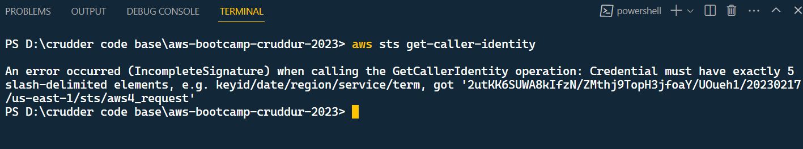
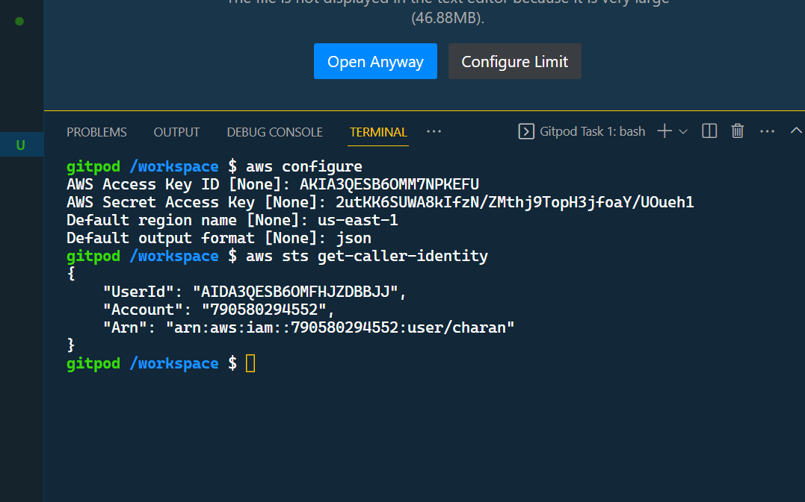
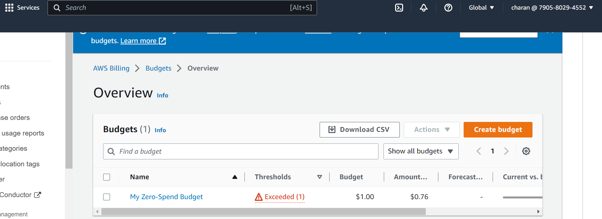
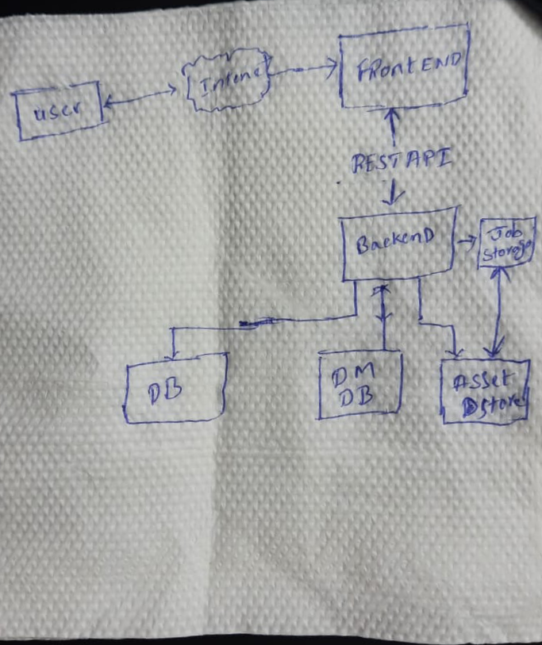
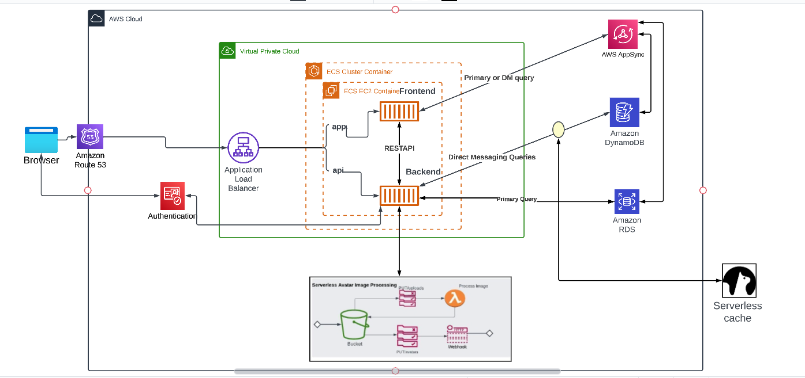
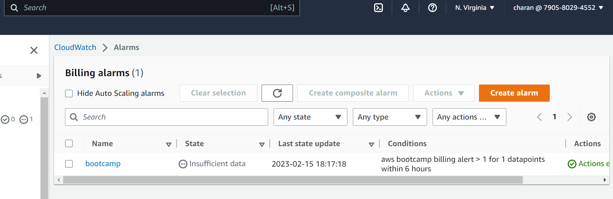
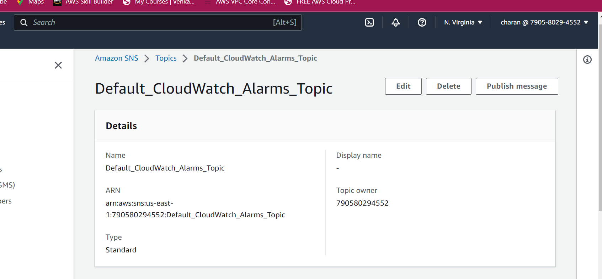

# Week 0 — Billing and Architecture

## Homework/Tasks

### installing AWS-CLI 
I have tried to install aws cli on gitpod terminal using the following code
~~~
curl "https://awscli.amazonaws.com/awscli-exe-linux-x86_64.zip" -o "awscliv2.zip"
unzip awscliv2.zip
sudo ./aws/install
~~~

i was failed in the first attempt. i was getting following error

I have revisted the whole process again and found out that i was swapping keyid for secret access key, then resolved by placing the right creds

Completed CLI installation

## AWS Budgets alarm

I have created my budget alarm which noties me when my budget exceeds $1. 

## Recreation of Logical Cruddur on a Napkin

I have followed the instructions using and drawn a design on napkin. 

Understood the business importance of archirecture daigram 

## Created Logical architecture using Lucid Charts

I have Created Logical Architecture using lucid charts software through faced some challenges to find the right Icons out, learnt it on the Go

here's the link [Lucidchart-architecture](https://lucid.app/lucidchart/da0ee0e6-29af-46e5-885c-035d5273c80e/edit?viewport_loc=-1103%2C-127%2C3281%2C1281%2C0_0&invitationId=inv_e831c85f-b424-4e72-a938-47353b634533)

## Created a Billing alarm in Cloud Watch

I have created a billing alarm in cloud watch to monitor the bootcamp expenditure.

I have created a SNS topic with my email subscription, whenver the alarm is breached i will be notified via email

 

